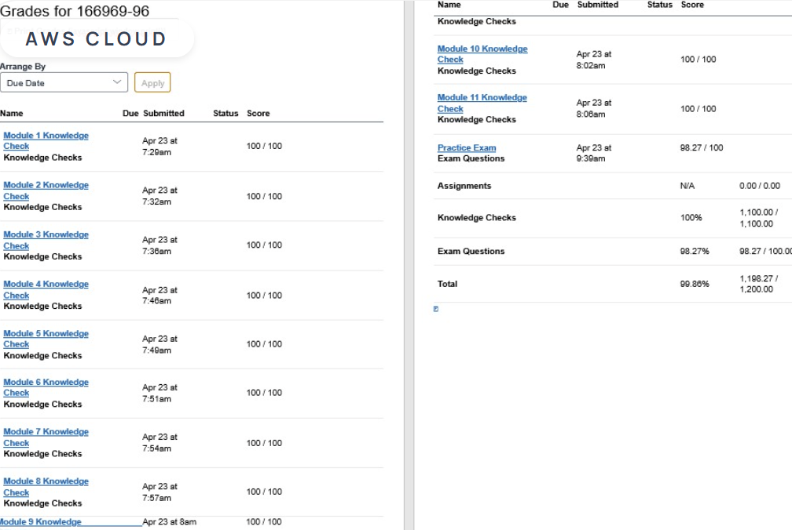

# AWS Cloud Course

## 📌 Overview
Successfully completed the AWS Cloud course with an overall score of 99.86%. Achieved 100/100 on all Knowledge Checks and 98.27/100 on the Practice Exam.
This learning journey strengthened my understanding of cloud computing fundamentals and AWS core services. Looking forward to applying these skills in real-world projects.
