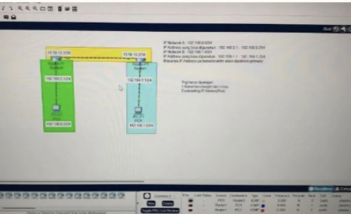

# Basic IT & Networking

## Overview
Basic IT & Networking Lab 🌐
Practiced fundamental networking concepts by designing and configuring a simple network topology using Cisco Packet Tracer. This lab covers IP addressing, device connectivity, and basic network communication to strengthen essential networking skills.
