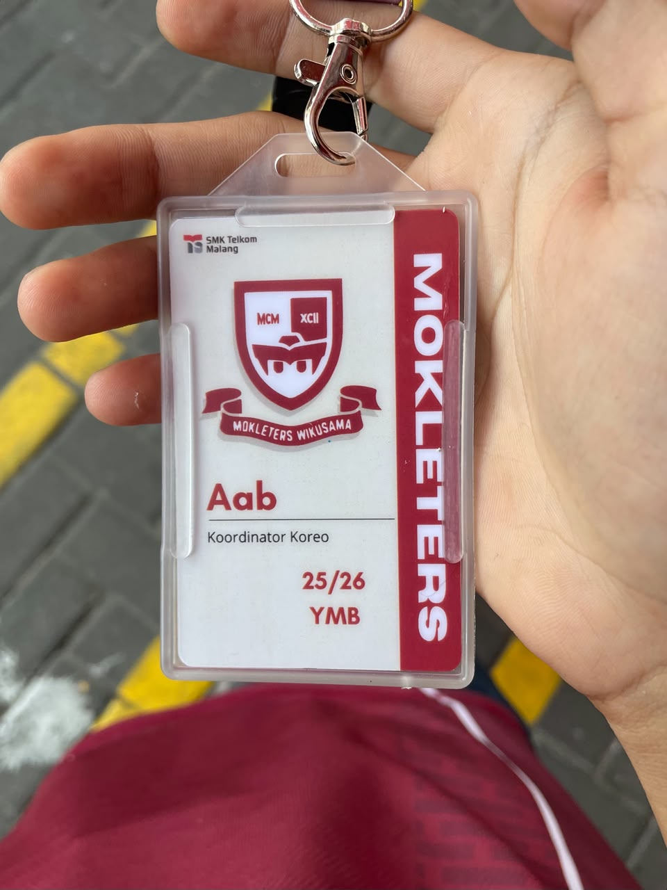

# Supporter Choreography Lead – School DBL

## Overview
Led the supporter choreography team during the School DBL event by coordinating members, planning choreography concepts, and ensuring synchronized performances to create an energetic and engaging game atmosphere.
